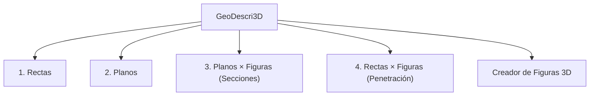

# **GeoDescri3D**
### *Plataforma Interactiva para la Enseñanza y Exploración del Sistema Diédrico y Geometría Descriptiva*

---

### 1. ¿Qué es GeoDescri3D?
**GeoDescri3D** es una aplicación web interactiva diseñada para la visualización, resolución analítica y modelado espacial en el **Sistema Diédrico Ortogonal** (Geometría Descriptiva). 

Su propósito es tender un puente inmediato entre el **espacio tridimensional (3D)** y su **representación bidimensional en el papel (Épura 2D)**, permitiendo a estudiantes, docentes, arquitectos e ingenieros comprender la relación directa entre un elemento espacial, sus proyecciones sobre el Plano Vertical (PV) y Plano Horizontal (PH), y su correspondiente proyección de perfil con abatimiento (3ª Proyección).

---

### 2. Módulos y Modos de Operación

La aplicación se estructura en **cuatro modos de trabajo principales**, además de un taller de modelado paramétrico:

#### 📏 Modo 1: Rectas en el Diedro
* **Tipologías soportadas**: Recta cualquiera (oblicua), horizontal (paralela a PH), frontal (paralela a PV), paralela a la Línea de Tierra (LT), de punta (perpendicular a PV), vertical (perpendicular a PH) y de perfil (perpendicular a LT).
* **Propiedades analíticas automáticas**:
  * Cálculo y visualización en tiempo real de la **Verdadera Magnitud (V.M.)** del segmento.
  * Trazas de la recta: Traza Vertical ($V_2, V_1$) y Traza Horizontal ($H_1, H_2$).
  * Rayos técnicos de correspondencia vertical y planos proyectantes.
  * **3ª Proyección (Perfil)** con arco de abatimiento a 90° para rectas de perfil y paralelas a LT.

#### 📐 Modo 2: Planos y Trazas
* **Tipologías soportadas**: Plano de Canto (proyectante vertical), Plano Vertical (proyectante horizontal), Plano Horizontal, Plano Frontal, Plano de Perfil, Plano Paralelo a la LT y Plano Oblicuo cualquiera.
* **Características y herramientas**:
  * **Trazas del plano ($\alpha_1, \alpha_2, \alpha_3$)**: Trazas analíticas exactas que indican la intersección del plano con PV, PH y el plano de perfil.
  * **Superficie Extendida**: Algoritmo analítico de recorte por *bounding-box* que expande el plano dentro de los límites del triedro sin salirse de las paredes diédricas ni generar colisiones de renderizado (*Z-fighting*).
  * **Cálculo de la Ecuación General del Plano**: $Ax + By + Cz + D = 0$.

#### 🔷 Modo 3: Planos × Figuras (Secciones Planas)
* **Sólidos base**: Prismas rectos y oblicuos, pirámides regulares e irregulares, cilindros y conos rectos.
* **Corte analítico**:
  * Seccionamiento por planos de canto, verticales, horizontales, frontales, de perfil y oblicuos mediante ajuste milimétrico de cota, alejamiento y ángulo de inclinación ($\alpha$ y $\beta$).
  * Detección exacta del polígono o curva cónica de la sección.
  * Cálculo de perímetro y perímetro en verdadera magnitud en el plano de perfil.
  * Rotulación automática de vértices de la sección en 3D ($S_n$), en alzado ($S_{n2}$) y en planta ($S_{n1}$).

#### 🎯 Modo 4: Rectas × Figuras (Penetración)
* Intersección volumétrica entre una recta orientada en el espacio y cualquier sólido.
* Determinación de los **puntos de entrada y salida ($I_1, I_2$)**.
* Discriminación visual del tramo exterior y el **tramo interior** (representado con trazo discontinuo técnico).
* Rayos de proyección de los puntos de penetración hacia PV y PH.

#### ⭐ Taller Creador de Figuras 3D (Paramétrico)
* Ventana modal con un **visor 3D secundario** que permite diseñar sólidos personalizados antes de insertarlos en el diedro:
  * **Ajuste punto por punto**: Tabla editable de coordenadas cartesianas para deformar la base vértice a vértice sin perder coherencia.
  * **Pirámide Irregular con vértice móvil**: Permite descentrar el ápice ($V$) libremente en los ejes $X, Y, Z$.
  * **Orientación de base intercambiable**: Apoyar sólidos en el Plano Horizontal (PH) o en el Plano Vertical (PV).
  * **Persistencia local**: Guarda figuras creadas en el almacenamiento local del navegador (`localStorage`) para reutilizarlas en cualquier momento.

---

### 3. Características Técnicas e Innovaciones de UX/UI

| Característica | Descripción |
| :--- | :--- |
| **Cámara Ortogonal Estricta** | Proyección axonométrica sin distorsión de fuga en perspectiva, garantizando paralelismo visual idéntico al dibujo técnico tradicional. |
| **Épura 2D con 3ª Proyección** | Lienzo canvas 2D sincronizado milimétricamente en tiempo real con la escena 3D, incluyendo arcos de abatimiento circular para el plano de perfil (PP). |
| **Guardrails de Invariantes Geométricos** | Si el usuario edita las coordenadas de un plano horizontal, el sistema mantiene la cota ($Y$) uniforme entre los 3 vértices. Si una modificación altera la naturaleza del plano, se despliega una **alerta visual preventiva**. |
| **Rotulado Cíclico Inteligente** | Selector de 3 estados para las etiquetas diédricas: `Solo Plano (A)` $\rightarrow$ `Todas (A, A₁, A₂)` $\rightarrow$ `Desactivadas`, optimizando la claridad visual en composiciones complejas. |
| **Etiquetas Translúcidas** | Badges 3D de alta legibilidad que no se ocultan ni se rompen visualmente cuando un plano transparente pasa por encima. |
| **Animaciones de Transición Suave** | Interpolación cúbica (*lerp ease-out*) al cambiar entre vistas predefinidas (3D Diédrica, Alzado Frontal, Planta Superior). |

---

### 4. Ficha Técnica

* **Entorno**: 100% Web del lado del cliente (Frontend).
* **Motor 3D**: [Three.js](https://threejs.org/) (r128) bajo WebGL.
* **Lienzo 2D**: HTML5 Canvas nativo para la épura diédrica.
